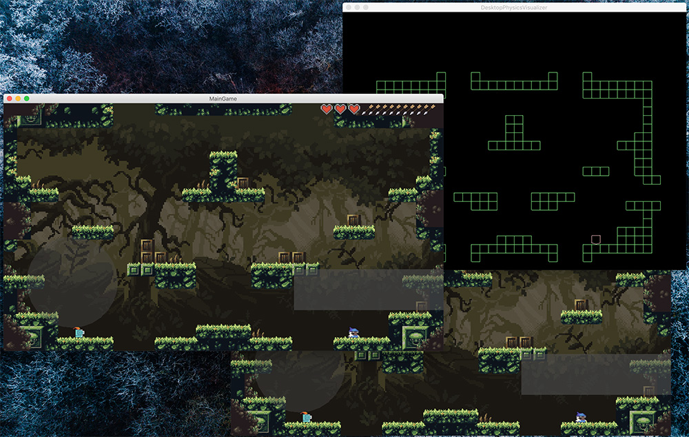

[](https://travis-ci.com/rosvik/ntnu-tdt4240-progark-project)

# Gradlefall IV: Directors Cut

Gradlefall is an Android game built to for the software architecture course, TDT4240, at NTNU. 



The game is a multiplayer, networked, competitive game. Inspiration is taken from the game [Towerfall](http://www.towerfall-game.com). Each player starts in a corner of a small arena. The players all have a visually different appearance. They have a finite amount of projectiles, and the goal is to shoot the other players.

## Running

Get the latest packaged files from [releases](https://github.com/rosvik/ntnu-tdt4240-progark-project/releases)

### Server

Run the server with `java -jar server-1.0.0.jar`. 

You can enable an experimental physics GUI with environment variables like this: 
```bash
DEBUG_PHYSICS_GUI_ENABLE=true java -jar server-1.0.0.jar
```

### Desktop client

Run the desktop client with `java -jar desktop-1.0.0.jar`.

You can change the server ip with environment variables like this:

```bash
SERVER_IP=localhost java -jar desktop-1.0.0.jar
```

### Android emulator

Run the android app by downloading it on a phone or via adb: `adb install android-debug.apk`. It may need to be signed and zipaligned. 

Run the application `cool-game` from your launcher.

## Contributing

### Plugins
#### Checkstyle
Install the `Checkstyle-IDEA` plugin in intellij:

1. `Settings` > `Plugins` > `Browse Repositories...`
2. Search `Checkstyle-IDEA` and install
3. Restart Android Studio
4. `Settings` > Search `Checkstyle`, pick `Other Settings` > `Checkstyle`
5. Add configuration file: `+`
    1. Description: `Project xml`
    2. `Local file` > `Browse` > `/game/config/checkstyle/checkstyle.xml`
    3. `Store relative to project location`
    4. `Next` untill done
6. Select the newly added xml file

Enable checkstyle as code style:

1. `Settings` > `Code style` > `Java`
2. Click the Cogwheel > `Import Scheme` > `Checkstyle` > `/game/config/checkstyle/checkstyle.xml`
3. Rename the style (Cogwheel > `Rename`) to Checkstyle
4. `OK`

Running checkstyle manually with gradle:

1. Open gradle menu
2. Run `checkstyleMain` task

#### Git pre-commit hook

Copy the file `/game/config/gitHooks/pre-commit` to `/.git/hooks/`

Alternatively, enable `Run checkstyle` checkbox in Android Studio commit dialog.

#### Lombok

Lombok can generate code with *annotation processing*: it reads your source code and writes code.

We use it to generate

```java
private static final org.slf4j.Logger log = org.slf4j.LoggerFactory.getLogger(ServerMain.class)
```

by adding `@SLF4J` before the class definition:

```java
@Slf4j
public final class ServerMain {
	// ...
}
```

Installing lombok:

1. `Settings` > `Plugins` > `Browse Repositories...`
2. Search for `Lombok`
3. Install and restart Android Studio.
